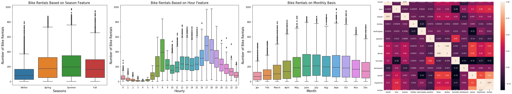

# Bike_Rental_Prediction

Project Overview: Leveraging State-of-the-Art Machine Learning for Enhanced Demand Forecasting

In today's business landscape, demand forecasts are indispensable for effective management. However, traditional techniques often fall short in achieving utmost accuracy. With the advent of Big Data, businesses have an unprecedented opportunity to harness vast volumes of data for increased productivity and economic benefits. Data analysts and scientists are leveraging historical data to derive meaningful insights, driving better data-driven decisions.

This project aims to embrace cutting-edge machine learning and artificial intelligence to enhance demand forecasting accuracy significantly. Focusing on the emerging bike sharing and Public Vehicle Rental Space, we are developing and refining state-of-the-art machine learning techniques to deliver the most precise predictive models with minimal errors.

Our approach involves constructing various forecasting models, including Linear Regression, Clustering, Random Forest, and Artificial Neural Networks. Through rigorous experimentation and practical discussions, we aim to showcase superior demand forecasting capabilities and their implications for consumer behavior and overall business performance.

By leveraging advanced analytics, we anticipate uncovering invaluable insights that will not only enhance demand forecasting accuracy but also drive strategic decision-making and competitive advantage in the market.

# Exploratory Data Analysis

# Data Attributes Distribution Graphs

# Predictive Model Line Graphs

